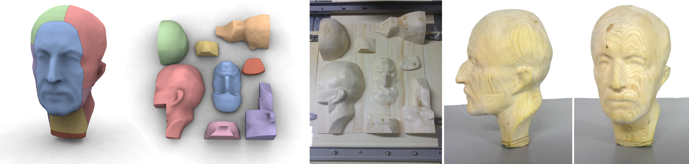

# Axis-Aligned Height-Field Block Decomposition of 3D Shapes

[Alessandro Muntoni](http://people.unica.it/alessandromuntoni/), [Marco Livesu](http://pers.ge.imati.cnr.it/livesu/), [Riccardo Scateni](http://people.unica.it/riccardoscateni/), [Alla Sheffer](https://www.cs.ubc.ca/~sheffa/), [Daniele Panozzo](http://cs.nyu.edu/~panozzo/)<br/>
*ACM Transaction on Graphics (2018)*<br/>



## Abstract
We propose a novel algorithm for decomposing general 3D geometries into a small set of overlap-free height-field blocks, volumes enclosed by a
flat base and a height-field surface defined with respect to this base. This decomposition is useful for fabrication methodologies such as 3-axis CNC
milling, where a single milling pass can only carve a single height-field surface defined with respect to the machine tray, but can also benefit other
fabrication settings. Computing our desired decomposition requires solving a highly constrained discrete optimization problem, variants of which are
known to be NP-hard. We effectively compute a high-quality decomposition by using a two-step process that leverages the unique characteristics of our
setup. Specifically, we notice that if the height-field directions are constrained to the major axes we can always produce a valid decomposition starting
from a suitable surface segmentation. Our method first produces a compact set of large, possibly overlapping, height-field blocks that jointly cover the
model surface by recasting this discrete constrained optimization problem as an unconstrained optimization of a continuous function, which allows
for an efficient solution. We then cast the computation of an overlap-free, final decomposition as an ordering problem on a graph, and solve it via a
combination of cycle elimination and topological sorting. The combined algorithm produces a compact set of height-field blocks that jointly describe
the input model within a user given tolerance. We demonstrate our method on a range of inputs, and showcase a number of real life models manufactured
using our technique.

\[[Paper](misc/paper.pdf)\]ù
\[[Web Site](http://pers.ge.imati.cnr.it/livesu/papers/MLSSP18/MLSSP18.html)\]
\[[Data](misc/results/)\]

## Source Code
Source code is hosted on this GitHub repository. The program is built and tested on Ubuntu 18.04 system with GCC 7.3.

### Downloading
```bash
git clone --recursive https://github.com/muntonialessandro/HeightFieldDecomposition.git
```
### Build and Run (Ubuntu 18.04)
```bash
sudo apt-get install qt5-default
sudo apt-get install libboost-all-dev libcgal-dev libgmp-dev libqglviewer-dev-qt5 libeigen3-dev
```

clone libigl and create an environment variable named LIBIGL_HOME containing its directory (https://github.com/libigl/libigl/)
install gurobi and create an environment variable named GUROBI_HOME containing its directory (https://www.gurobi.com/)
clone cinolib and create an environment variable named CINOLIB_HOME containing its directory (https://github.com/maxicino/cinolib)

```bash
qmake HeightFieldDecomposition.pro
make
```

## License
[MPL2](http://www.mozilla.org/MPL/2.0/) licensed
([FAQ](http://www.mozilla.org/MPL/2.0/FAQ.html))


